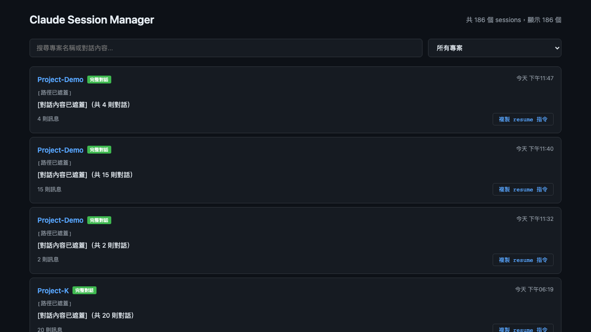
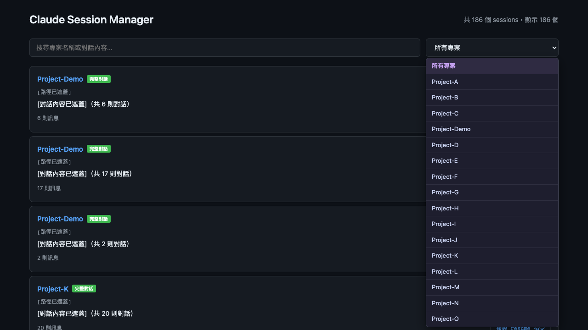
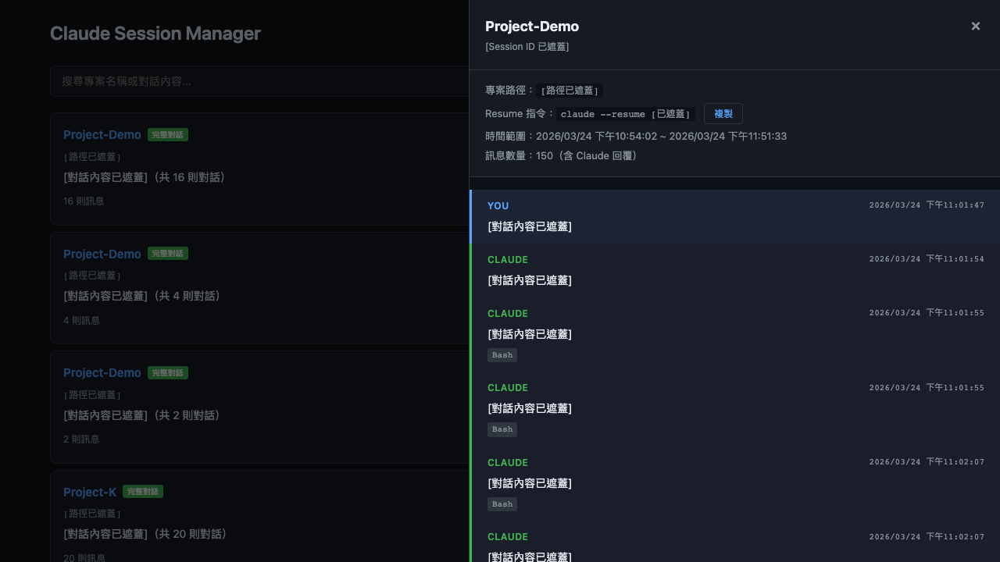
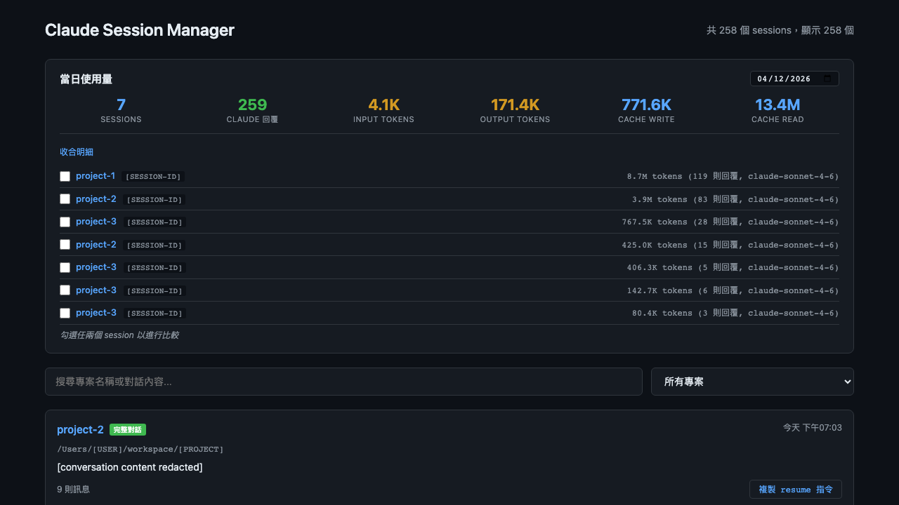
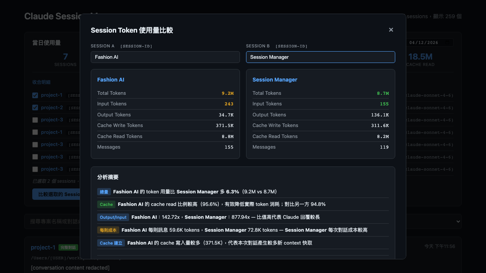
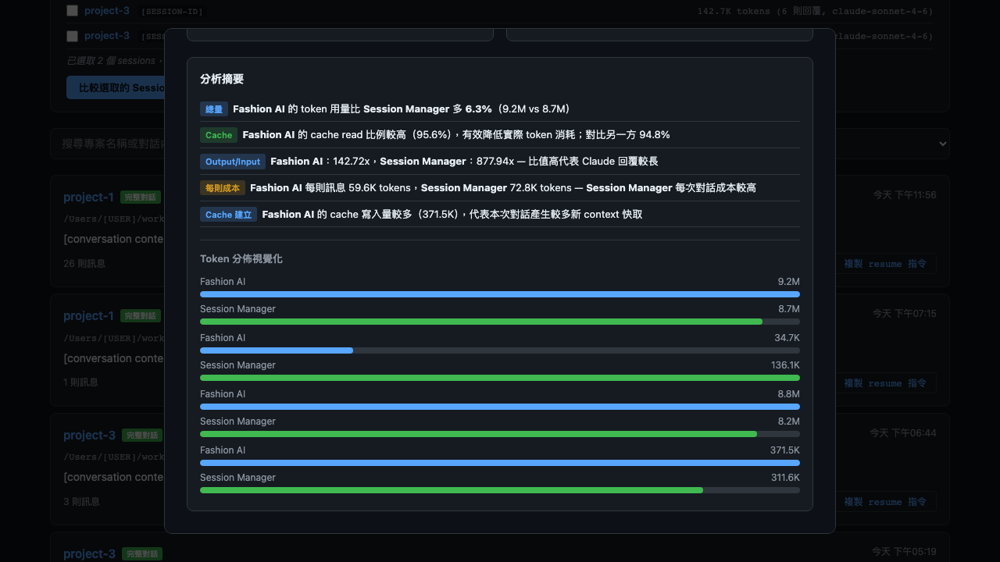

# Claude Session Manager

Browse, search, and resume your Claude Code sessions from a web UI.

## Screenshots


*Session list with project filter and search*


*Filter sessions by project*


*Full conversation history with resume command*


*Select two sessions from the daily usage view to compare token usage side by side*


*Assign custom aliases to each session — all analysis text and charts update instantly*


*Token distribution bar charts and detailed analysis summary*

## Features

- **Session list** — all past sessions sorted by most recent, with project name and first message preview
- **Full conversation view** — click any session to see the complete chat history including Claude's responses
- **Full-text search** — searches across project paths, summaries, and full conversation content (including Claude's replies)
- **Match snippets** — search results show highlighted context around matched text
- **Resume command** — one-click copy of `claude --resume <id>` for any session
- **Project filter** — filter sessions by project name
- **Daily usage statistics** — token usage dashboard showing input/output/cache tokens, message count, and per-session breakdown with date picker
- **Session comparison** — select any two sessions from the daily usage view to compare token usage side by side; includes bar chart visualization, and analysis covering total token delta, cache read efficiency, output/input ratio, and per-message cost
- **Session aliases** — in the comparison modal, assign custom names to each session (Session A / B) so the analysis text and charts use your labels instead of the default project+ID format

## Requirements

- [Bun](https://bun.sh) v1.3+
- [Claude Code](https://claude.ai/code) — reads session data from `~/.claude/`

## Setup

```bash
bun install
bun run dev     # with hot reload
# or
bun run start   # production
```

Open http://localhost:3456

## How it works

Reads two data sources from `~/.claude/`:

| Source | Content |
|--------|---------|
| `history.jsonl` | All user inputs with session ID, project path, timestamp |
| `projects/<slug>/<sessionId>.jsonl` | Full conversation files (user + Claude messages) |

Sessions without a conversation file (older sessions) still appear in the list but only show user messages.

## Project structure

```
src/
  server.ts                  # Express entry point (port 3456)
  routes/sessions.ts         # GET /api/sessions, GET /api/sessions/:id
  routes/usage.ts            # GET /api/usage?date=YYYY-MM-DD
  services/sessionParser.ts  # Parses ~/.claude data
  public/index.html          # Frontend UI
```
